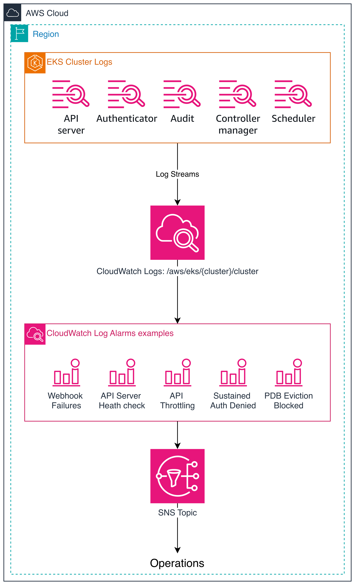

# EKS Control Plane Log Alarms

A CloudFormation stack that deploys [CloudWatch Log Alarms](https://docs.aws.amazon.com/AmazonCloudWatch/latest/monitoring/alarm-log.html) for Amazon EKS control plane logs. These alarms detect operational issues that **only exist in logs** — signals invisible to standard CloudWatch metrics, or where the metric lacks the per-resource detail needed to act.

> **⚠️ Non-production sample code.** This repository contains sample code for demonstration and educational purposes and is not intended for production use as-is. Review, test, and adapt the templates, thresholds, and scripts to your own security, reliability, and operational requirements before deploying to any production environment. The test scripts in `tests/` intentionally create failure conditions and must only be run against disposable test clusters.

## Alarms

| Alarm | What it detects | Log Source |
|-------|----------------|------------|
| Webhook Failures | Admission webhooks failing to respond | kube-apiserver (non-audit) |
| Webhook Latency | Webhooks adding > 5s latency to API calls | kube-apiserver-audit |
| API Server Health Check Failed | Internal /healthz endpoint failures | kube-apiserver (non-audit) |
| API Throttling (429s) | APF rejecting requests with HTTP 429 | kube-apiserver-audit |
| PDB Eviction Blocked | Evictions repeatedly blocked by PodDisruptionBudgets | kube-apiserver-audit |
| Sustained Auth Denied | Repeated IAM authentication denials | authenticator |
| Noisy Client List Storms | Excessive LIST requests degrading API performance | kube-apiserver-audit |
| Startup Probe Failures | Containers stuck failing startup probes | kube-apiserver-audit |

Each alarm includes log context in notifications (via `ActionLogLineCount`) so you get the relevant log lines directly in your alert.

For detailed query logic, thresholds, tuning, and response runbooks see [docs/alarm-patterns.md](docs/alarm-patterns.md).

## Prerequisites

- An EKS cluster with [control plane logging](https://docs.aws.amazon.com/eks/latest/userguide/control-plane-logs.html) enabled (at minimum: `api`, `audit`, `authenticator`)
- AWS CLI v2 configured with appropriate permissions
- (Optional) An existing SNS topic, or let the stack create one

Need a test cluster? Deploy one with [examples/prerequisite-cluster.yaml](examples/prerequisite-cluster.yaml).

## Quick Start

```bash
aws cloudformation deploy \
  --template-file template.yaml \
  --stack-name eks-log-alarms-{cluster} \
  --parameter-overrides \
    "ClusterName={cluster}" \
    "CreateSNSTopic=true" \
    "NotificationEmail={email}" \
  --capabilities CAPABILITY_NAMED_IAM
```

Or use the helper script:

```bash
./examples/deploy.sh my-cluster ops@example.com us-west-2
```

## Customization

### Enable/Disable Individual Alarms

Each alarm has a toggle parameter (all default to `true`):

```bash
--parameter-overrides \
  EnableWebhookFailures=true \
  EnableWebhookLatency=true \
  EnableAPIServerHealthCheck=true \
  EnableAPIThrottling=true \
  EnablePDBEvictionBlocked=true \
  EnableAuthDenied=true \
  EnableNoisyClient=true \
  EnableStartupProbeFailures=false
```

### Adjust Thresholds and Schedule

```bash
--parameter-overrides \
  QuerySchedule="rate(5 minutes)" \
  LookbackWindowSeconds=600 \
  EvaluationPeriods=3 \
  DatapointsToAlarm=2
```

Individual alarm thresholds are set in `template.yaml` — modify the `Threshold` field for each alarm resource.

### Use an Existing SNS Topic

```bash
--parameter-overrides \
  CreateSNSTopic=false \
  ExistingSNSTopicARN=arn:aws:sns:us-east-1:123456789012:my-topic
```

## Architecture



The stack deploys:
- **IAM Roles** — one for scheduled query execution, one for log line retrieval in alarm notifications
- **SNS Topic** (conditional) — for alarm delivery, encrypted at rest
- **KMS Key + Alias** (conditional, created with the SNS topic) — a customer-managed key whose policy grants CloudWatch alarms `kms:Decrypt`/`kms:GenerateDataKey*`; the AWS-managed SNS key cannot be used because its policy cannot grant CloudWatch access
- **8 CloudWatch Log Alarms** — each running a Logs Insights query on the EKS control plane log group on a schedule

> If you bring your own topic (`ExistingSNSTopicARN`) and it is encrypted with a customer-managed key, that key's policy must grant `cloudwatch.amazonaws.com` the same `kms:Decrypt` and `kms:GenerateDataKey*` permissions, or alarm notifications will silently fail.

All alarms evaluate on the same schedule (default: every 5 minutes) and use M-of-N evaluation (default: 2 of 3 datapoints breaching) to reduce noise.

## Testing

Trigger alarm conditions in a test cluster — run everything, or one alarm at a time:

```bash
# Trigger all testable alarms
./tests/trigger.sh my-cluster

# Trigger a single alarm
./tests/trigger.sh my-cluster pdb-eviction
```

| Test | What it does |
|------|--------------|
| `webhook-failures` | Webhook pointing at a service with no backend, then configmap creates |
| `webhook-latency` | Webhook backed by a TCP tarpit pod (best-effort, see note below) |
| `api-throttling` | Temporary narrowly-scoped APF FlowSchema/PriorityLevelConfiguration (Reject, minimal concurrency) + parallel configmap load; APF objects are removed when the test finishes |
| `pdb-eviction` | 2 replicas + PDB `minAvailable: 2`, then a node drain attempt (node is uncordoned afterward) |
| `auth-denied` | Creates a temporary IAM role not mapped to the cluster and calls the API with it |
| `noisy-client` | Burst of 600 LIST pod requests (no resources created) |
| `startup-probe` | Pods with a startup probe on a closed port |

Because alarms use M-of-N evaluation (default 2 of 3), a single short burst may not flip an alarm to `ALARM` — sustained conditions (failing webhooks, probe loops) reliably do, while one-shot bursts (`noisy-client`, `api-throttling`) may need a second run 5 minutes later to produce enough breaching datapoints.

All namespaced test resources are created in a dedicated `eks-alarm-test` namespace.

**Permissions needed to run the tests:** cluster-admin-level kubectl access (the tests create cluster-scoped `ValidatingWebhookConfiguration` and APF objects, and drain a node) and AWS credentials that can create/delete one temporary IAM role (`eks-log-alarm-test-unauthorized`, used by the auth-denied test).

> **Not triggerable:** the `apiserver-health-check-failed` alarm cannot be triggered from the user side — its signal originates inside the managed EKS control plane.
>
> **Best-effort:** the `webhook-latency` test deploys the slow-webhook condition, but the EKS managed control plane fails open in milliseconds when a webhook backend doesn't complete TLS, so no latency annotation is recorded and the alarm may not fire. It fires for genuinely slow webhooks that speak valid TLS, which the test cannot simulate without provisioning a certificate-bearing webhook server.

> **Note:** checking log alarm states requires AWS CLI v2.36 or later (`--alarm-types LogAlarm`).

Wait 15–20 minutes after triggering, then check alarm states:

```bash
aws cloudwatch describe-alarms \
  --alarm-name-prefix "my-cluster-" \
  --alarm-types LogAlarm \
  --query 'LogAlarms[].{Name:AlarmName,State:StateValue}' \
  --output table
```

The trigger run (especially `all`) can take 10+ minutes. If you use short-lived credentials (e.g., STS sessions), make sure they won't expire mid-run.

When you're done, remove the alarm conditions so alarms return to OK:

```bash
./tests/cleanup.sh my-cluster
```

Cleanup removes the test webhook configurations, any leftover APF objects, the `eks-alarm-test` namespace and everything in it, the temporary IAM role, and uncordons any node left cordoned by an interrupted drain. It is idempotent. Alarms transition back to OK within 15–25 minutes as breaching datapoints age out of the evaluation window.

## Cost Considerations

- Each Log Alarm executes a Logs Insights query on schedule. With 8 alarms at `rate(5 minutes)`, that's ~96 queries/hour.
- CloudWatch Logs Insights charges per GB scanned. Cost depends on your log volume.
- The customer-managed KMS key (when the stack creates the SNS topic) costs ~$1/month plus per-request charges (negligible at alarm volumes).
- The SNS topic and IAM roles incur negligible cost.
- Estimate: $5–$30/month per cluster depending on log volume.

## Limitations

- Minimum query interval is 1 minute (not real-time alerting)
- Log groups must be in CloudWatch Logs (not S3 or third-party destinations)
- Cross-region log group queries not supported
- Maximum 50 log groups per alarm

## Contributing

See [CONTRIBUTING.md](CONTRIBUTING.md).

## License

MIT-0
